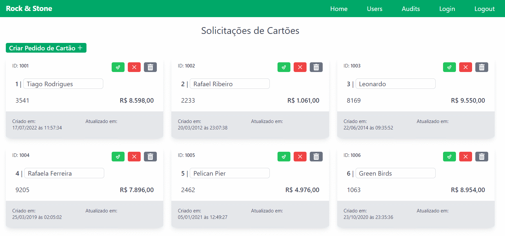

# Rock & Stone

Esta aplicação é um teste prático feito para a Stone. Ela permite com que um `Analyst` veja, crie, atualize e delete pedidos de `Cards`.

Cada pedido de `Card` deve ser vinculado a um `User` que possui a função habilitada segundo suas `Features`.

Toda ação dessa aplicação gera uma `Audit`.



## Projeto

### Como rodar o APP Cliente-Servidor

```sh
yarn build
yarn dev

ou

npm run build
npm run start
```

output:

```
// CRA - Acessar pelo navegador
  http://localhost:3000/

// Api
  Resources:
  http://localhost:3001/api/users
  http://localhost:3001/api/analysts
  http://localhost:3001/api/cards
  http://localhost:3001/api/features
  http://localhost:3001/api/audits
```

### Dev Dependencies

- @babel/core
- @babel/preset-env
- @babel/preset-typescript
- @testing-library/jest-dom
- @types/jest
- @types/react-router-dom
- babel-jest
- jest
- jest-environment-jsdom
- msw
- tailwindcss
- ts-jest

### Aos avaliadores

##### TODO

Comentários de melhorias e possibilidades de expansão do projeto estão marcados com `TODO`'s

##### TECH

Explicações sobre decisões técnicas estão marcadas em comentários com `TECH`'s

##### Responsividade

A aplicação pode ser executada em qualquer tamanho de tela.

### Testes automatizados

Para testar:

```
  npm test
```

Alguns testes de exemplo foram feitos com Jest. Realizei poucos testes por causa do prazo, pois pude trabalhar no teste apenas em pouco tempo livre ao longo da semana.
Porém creio que as tipagens estão bem feitas e bem utilizadas, amarrando todo o sistema entre as tipagens das entidades básicas, reduzindo muito a propensão de erro.

Testes estáticos são desnecessários devido ao Typescript.

```
TODO: Testes unitários nos componentes isolados: A store já está mockada no provider do redux.

TODO: Testes de integração: Criação, aprovação, reprovação, edição de nome e exclusão de cards. Testar auditorias geradas em cada caso. Testar autenticação.
```

### Heroku Deploy

O Heroku descontinuou sua versão gratuita em 2022.
